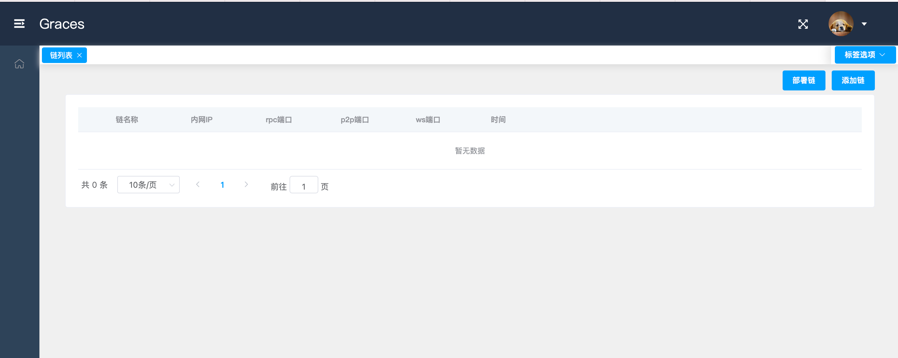

# README

## 环境准备

### 硬件环境准备

- 主  机：Intel Xeon E5-2650或以上。

- 内  存：16G或以上。

- 硬  盘：32GB或以上。

- 图形卡：VGA/DVI。

### 软件环境准备

- OS	Linux 64bit
- Golang 1.14.4 或以上
- Venachain v1.0.0 或以上
- MongoDB 4.2.8 或以上
- npm 6.14.13 或以上
- nodjs v14.17.1 或以上
- Graces v1.0.0

## 安装步骤

1. 下载、安装和配置 Golang

2. 下载、安装和启动 MongoDB
   
3. 下载和编译 Venachain

   安装文档：https://venachain-docs.readthedocs.io/zh/latest/documents/quick/env.html

4. 下载 Graces V1.0.0 

   - 下载 Graces 后端源码：

      下载地址：https://git-c.i.wxblockchain.com/vena/src/graces/graces-server/-/archive/v1.0.0/graces-server-v1.0.0.zip

      重命名：

      ```sh
      mv graces-server-v1.0.0.zip ./graces-server.zip
      ```

   - 下载 Graces 前端源码：

      下载地址：https://git-c.i.wxblockchain.com/vena/src/graces/graces-web/-/archive/v1.0.0/graces-web-v1.0.0.zip

      重命名：

      ```sh
      mv graces-web-v1.0.0.zip ./graces-web.zip
      ```

      下载完成后对项目文件进行解压。

      ```sh
      unzip graces-server.zip
      unzip graces-web.zip
      ```

   

5. 配置 Graces 前端

   进到 graces-web 目录下，修改 `.env.development` 文件中 base api 下的 `localhost:9999` 为自己机器的 IP 端口号或域名端口号，如果不修改则默认使用 `localhost:9999` 。

   ```
   # base api
   VUE_APP_BASE_API = 'http://localhost:9999/api'
   VUE_APP_BASE_WS = 'ws://localhost:9999/api'
   ```

6. 配置 Graces 后端

   1. 进到 graces-server 目录下。

   2. 在 `go.mod` 文件中配置好对 Venachain 的依赖，修改为自己下载好且编译好后的 Venachain 路径

      ```mod
      replace (
          github.com/Venachain/Venachain => /你的路径/Venachain-1.0.0
      )
      ```

   3. 在 `config.toml` 文件中配置 Graces 运行的 IP 地址和端口号。需要注意的是，cors 的值必须是 Graces 前端的运行地址，本示例前端运行在 http://localhost:8080 中。

      ```toml
      [http]
      ip = "127.0.0.1"
      port = "9999"
      # mode 必须是 "release"、"debug"、"test" 中的一个
      mode = "debug"
      # cors 跨域资源共享白名单
      cors = "http://localhost:8080"
      ```

   4. 在 `config.toml` 文件中配置 Graces 所需的 MongoDB 信息，如有需要则修改为自己的 MongoDB 配置。

      ```toml
      [db]
      ip = "127.0.0.1"
      port = "27017"
      username = "username"
      password = "password"
      dbname = "graces"
      timeout = 10
      ```

7. 启动 Graces

   1. 启动 Graces 后端

      进到 graces-server 目录下，执行以下命令

      ```sh
      go build -o graces
      nohup ./graces > ./graces.log 2>&1 &
      ```

   2. 启动 Graces 前端

      进到 graces-web 目录下，执行以下命令

      ```sh
      npm install
      npm run dev
      ```

8. 访问 Graces

   开打浏览器，输入 `http://localhost:8080` 便可以进到 Graces 主页面。

   

   

   