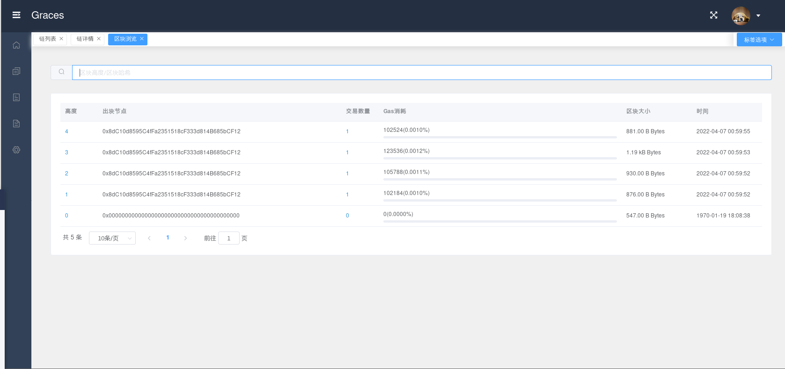
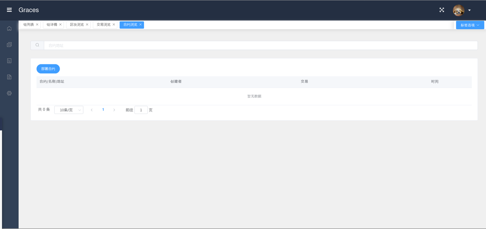
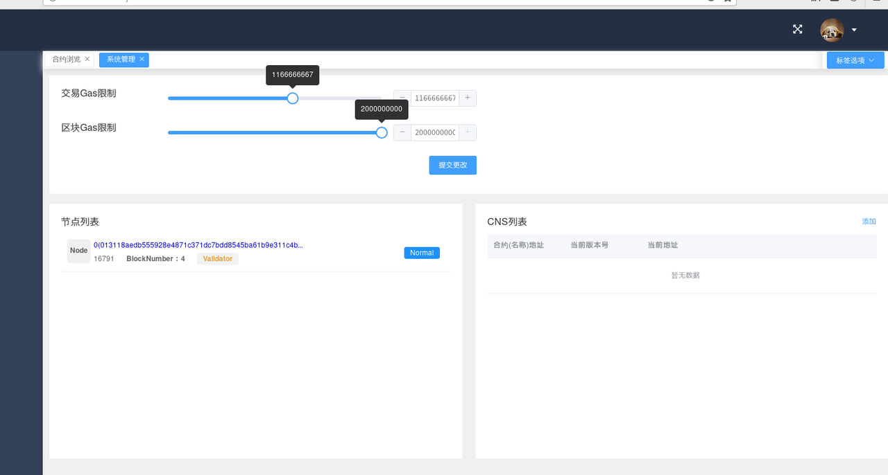

# graces的使用

##  1.打开网站

输入http://localhost:8080/

## 2.添加链

- ### 启动对应的链

- ### 点击右上角的添加链

  

- ### 输入对应的信息

  

- ### 可以看到链已经成功添加

  

​         注：第一次添加需要点击全量同步，等待数据同步完成后才能看到链的数据。

## 3.使用链

- ### 点击链的名称进入到该链中

  

### 区块浏览

- 点击菜单栏的第二个区块浏览

  

​        可以看到区块的高度，出块节点，交易数量等信息。您也可以搜索您想要的区块高度。
2. ### 交易浏览
- 点击菜单栏的第三个交易浏览

  

​      可以看到交易哈希，高度，交易的账户地址等信息。您也可以搜索您想要的交易哈希。
3. ### 合约浏览
- 点击菜单栏的第四个合约浏览

  

- 点击左上角的部署合约

  

您可以上传您的合约文件（只能上传两个文件）和设置CNS。
4. ### 系统管理
- 点击菜单栏的第五个系统管理

  

​       在这里您可以设置交易Gas限制以及区块Gas限制，提交更改后方可生效。您可以看到链上的节点列表以及CNS列表

​       **注意：不要轻易修改链上的配置参数**