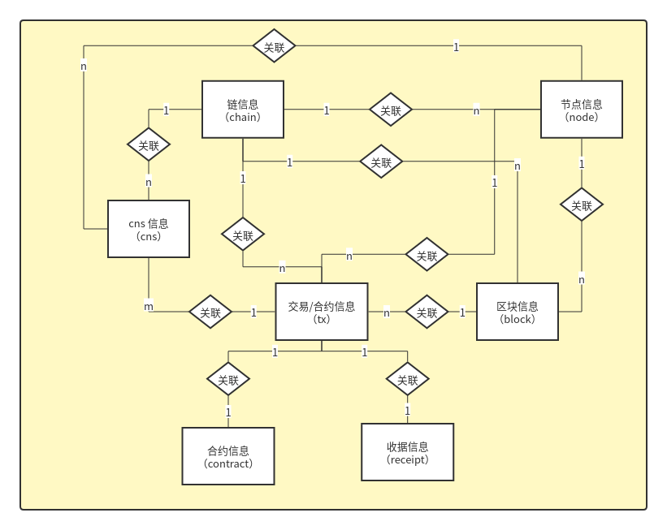

# Graces 详细设计

|    时间    | 修改人 | 修改事项 | 版本  |
| :--------: | :----: | :------: | :---: |
| 2021.09.16 |  杨毅  |   完善   | 0.0.2 |
| 2021.07.29 |  杨毅  |   初稿   | 0.0.1 |

[TOC]

## 一. 概述

通过《Graces 需求说明》和《Graces 概要设计》两个文档，我们已经清楚的知道了 Graces 整体所需要实现的模块和功能，现在依照《Graces 概要设计》文档所划分的模块，对这些模块的功能开发进行更为详细的设计。

## 二. 数据获取模块设计

### 数据库设计

#### E-R 图

#### 数据模型

- chains -链信息

| Name         | Type   | Description                          |
| ------------ | ------ | ------------------------------------ |
| id           | string | 主键ID                               |
| name         | string | 链名称                               |
| username     | string | 在服务端部署链时所需的服务端操作用户 |
| ip           | string | 链第一个节点的 IP 地址               |
| rpc_port     | int    | 链第一个节点的 rpc 端口号            |
| p2p_port     | int    | 链第一个节点的 P2P 端口号            |
| ws_port      | int    | 链第一个节点的 websocket 端口号      |
| desc         | string | 链的描述信息                         |
| chain_config | object | 链第一个节点的配置信息               |
| create_time  | string | 创建时间                             |
| update_time  | string | 最后一次更新时间                     |
| delete_time  | string | 删除时间                             |

- nodes -节点信息

| Name        | Type   | Description     |
| ----------- | ------ | --------------- |
| id          | string | 主键ID          |
| chain_id    | string | 所属链ID        |
| name        | string | 节点名称        |
| public_key  | string | 节点公钥        |
| desc        | int    | 节点描述        |
| internal_ip | string | 节点内网 IP     |
| external_ip | int    | 节点公网 IP     |
| rpc_port    | int    | 节点 RPC 端口号 |
| p2p_port    | int    | 节点 P2P 端口号 |
| type        | string | 节点类型        |
| status      | int    | 节点状态        |
| owner       | string | 节点部署人      |

- blocks -区块信息

| Name        | Type    | Description                     |
| ----------- | ------- | ------------------------------- |
| id          | string  | 主键ID                          |
| chain_id    | string  | 所属链ID                        |
| hash        | string  | 区块哈希                        |
| height      | int     | 区块高度                        |
| timestamp   | int | 区块生成时间                    |
| tx_amount   | int     | 区块内部交易数量                |
| proposer    | int | 挖出该区块的矿工地址            |
| gas_used    | int     | 区块内部所有交易的 Gas 使用总量 |
| gas_limit   | int     | 区块内部所有交易的 Gas 限制量   |
| parent_hash | string  | 上一个区块的哈希                |
| extra_data  | string  | 区块的额外信息                  |
| size        | string  | 区块大小                        |
| head        | object  | 区块头信息                      |

- head -区块头信息

| Name              | Type   | Description                     |
| ----------------- | ------ | ------------------------------- |
| parent_hash       | string | 上一个区块的哈希                |
| miner             | string | 挖出该区块的矿工地址            |
| state_root        | string | merkle 状态树的根哈希           |
| transactions_root | string | merkle 交易树的根哈希           |
| receipts_root     | string | merkle 收据树的根哈希           |
| logs_bloom        | string | LogsBloom                       |
| height            | int    | 区块高度                        |
| gas_limit         | int    | 区块内部所有交易的 Gas 限制量   |
| gas_used          | int    | 区块内部所有交易的 Gas 使用总量 |
| timestamp         | int    | 区块生成时间                    |
| extra_data        | string | 区块的额外信息                  |
| mix_hash          | string | 混合哈希                        |
| nonce             | int    | 区块 POW 随机数                 |
| hash              | string | 区块哈希                        |

- txs -交易信息

| Name      | Type    | Description    |
| --------- | ------- | -------------- |
| id        | string  | 主键ID         |
| chain_id  | string  | 所属链ID       |
| block_id  | string  | 所属区块ID     |
| hash      | string  | 交易哈希       |
| height    | int     | 所属区块高度   |
| timestamp | int | 交易发起时间   |
| from      | string  | 交易发起人地址 |
| to        | string  | 交易目标地址   |
| gas_limit | int     | Gas 限制       |
| gas_price | int     | Gas 价格       |
| nonce     | string  | 随机数         |
| input     | string  | input 数据     |
| value     | int     | 交易数额       |
| receipt   | object  | 收据信息       |

- contract -合约信息

| Name      | Type   | Description                           |
| --------- | ------ | ------------------------------------- |
| id        | string | 主键ID                                |
| chain_id  | string | 所属链ID                              |
| address   | string | 合约地址                              |
| creator   | string | 合约创建人地址                        |
| tx_hash   | string | 部署合约时的交易哈希                  |
| content   | string | 合约内容（对应的是 tx 的 input 数据） |
| timestamp | int    | 部署时间                              |

- receipt -交易收据信息

| Name             | Type   | Description |
| ---------------- | ------ | ----------- |
| contract_address | string | 合约地址    |
| status           | int    | 交易状态    |
| event            | string | 事件信息    |
| gas_used         | int    | Gas 使用量  |

- cns -CNS 信息

| Name     | Type   | Description |
| -------- | ------ | ----------- |
| id       | string | 主键ID      |
| chain_id | string | 所属链ID    |
| name     | string | 名称        |
| version  | string | 版本号      |
| address  | string | 合约地址    |

- account -账户信息

| Name     | Type   | Description |
| -------- | ------ | ----------- |
| id       | string | 主键ID      |
| chain_id | string | 所属链ID    |
| node_id  | string | 所属节点ID  |
| account  | string | 账户地址    |

### 各数据获取流程

#### 1. 链信息数据

- 把已在运行的链添加到 Graces
  1. 填写并提交链信息
  2. 对链信息进行判重
  3. 对链的第一个节点进行连接校验
  4. 链信息保存入库
  5. 为该链添加事件订阅
- 通过 Graces 部署一条新的链
  1. 填写并提交链信息
  2. 对链信息进行判重
  3. 异步调用部署脚本
  4. 等待部署结果回执
  5. 对链的第一个节点进行连接校验
  6. 链信息保存入库
  7. 为该链添加事件订阅

#### 2. 节点数据获取

通过查阅 PlatONE 相关文档发现，想要获取到链的节点数据，需要去调用链的预编译合约  `NodeManagement` 的 `getAllNodes`  函数才能拿到，PlatONE 为我们提供了合约调用的 RPC 接口，我们现在只需要按照 RPC 接口的合约调用步骤进行处理即可。

1. 使用链第一个节点的 IP 地址和 RPC 端口号构建一个 RPC Client。
2. 封装合约调用所需的参数，指定调用 `NodeManagement` 合约的 `getAllNodes`  函数。
3. 通过 Client 执行合约调用请求。
4. 解析合约调用返回的节点数据，并封装为 Graces 所需的数据结构。
5. 把封装后的数据保存入库。

#### 2. 区块数据获取

通过查阅 PlatONE 相关文档发现，想要获取到链的区块数据，可以通过调用链提供的 `blockByNumber` 或 `blockByHash` RPC 接口来得到单个区块的数据。由于 Graces 需要拿到所有区块的数据，所以这里选择的是 `blockByNumber` 接口，因为 `blockByNumber` 可以通过传入 null 值来拿到链上的最新区块 LatestBlock，进而可以拿到最新区块的块高 LatestBlockHeight，然后我们只需要从 0 开始遍历块高到 LatestBlockHeight，在遍历的同时以当前遍历到的数值当做块的高度，一一请求 `blockByNumber`  接口就可以拿到链上所有的区块数据。

1. 使用链第一个节点的 IP 地址和 RPC 端口号构建一个 RPC Client。
2. 通过 Client 调用 `blockByNumber` 接口传入 null 值拿到链上的最新区块 LatestBlock 和 它的高度 LatestBlockHeight。
3. 从 0 开始遍历块高到 LatestBlockHeight，以当前遍历到的数值当做块的高度，一一请求 `blockByNumber`  接口拿到对应高度的区块数据。
4. 把每一个返回的区块数据封装成 Graces 所需的数据结构。
5. 把封装后的数据保存入库。

#### 3. 交易数据获取

通过查阅 PlatONE 相关文档发现，交易数据可以从链的 RPC 接口  `blockByNumber`  返回的区块数据中拿到，这里拿到的是该区块所打包的所有交易数据，想要拿到链上的所有交易数据，一样需要对每一个区块做遍历处理，所以对于交易数据的获取流程，我们把它放入区块数据获取的流程中一起处理。

1. 使用链第一个节点的 IP 地址和 RPC 端口号构建一个 RPC Client。
2. 通过 Client 调用 `blockByNumber` 接口传入 null 值拿到链上的最新区块 LatestBlock 和 它的高度 LatestBlockHeight。
3. 从 0 开始遍历块高到 LatestBlockHeight，以当前遍历到的数值当做块的高度，一一请求 `blockByNumber`  接口拿到对应高度的区块数据。
4. 解析每一个区块的交易数据，并把它们封装成 Graces 所需的数据结构。
5. 把封装后的数据保存入库。

#### 4. CNS 数据获取

通过查阅 PlatONE 相关文档发现，想要获取到链的 CNS 数据，需要去调用链的预编译合约  `CnsManagement` 的 `getRegisteredContracts`  函数才能拿到，PlatONE 为我们提供了合约调用的 RPC 接口，我们现在只需要按照 RPC 接口的合约调用步骤进行处理即可。

1. 使用链第一个节点的 IP 地址和 RPC 端口号构建一个 RPC Client。
2. 封装合约调用所需的参数，指定调用 `CnsManagement` 合约的 `getRegisteredContracts`  函数。
3. 通过 Client 执行合约调用请求。
4. 解析合约调用返回的 CNS 数据，并封装为 Graces 所需的数据结构。
5. 把封装后的数据保存入库。

#### 5. 合约数据获取

通过查阅 PlatONE 相关文档发现，想要通过 RPC 接口请求来拿到所有合约数据目前还做不到，目前只能获取到已经注册进 CNS 的合约，不注册进 CNS 的合约则无法拿到。但由于合约部署都是通过发交易来进行的，由此我们可以在收到交易数据时对它进行判断，如果是合约部署交易，则提取出它对应的合约信息保存到合约信息表中即可。

#### 6. 链账户数据获取

通过查阅 PlatONE 相关文档发现，链账户是分散存储在各个链节点之中的，PlatONE 为我们提供了`personal_listAccounts` RPC 接口用于获取当前连接所在的节点的账户列表，而想要拿到所有的链账户数据，则需要遍历链的所有节点一一处理。

1. 读取链的所有节点数据。
2. 遍历链的所有节点数据，为每一个节点创建一个 RPC Client 连接。
3. 通过 Client 调用 `personal_listAccounts` 接口拿到每一个节点的链账户数据，并封装为 Graces 所需的数据结构。
4. 链账户数据不做存储处理，只在需要查询时封装返回。

### 数据同步

#### 全量同步

从链上拿到所有所需的数据，然后以新数据为准，对于 Graces 已经存在的数据做更新，对于 Graces 还没有的数据做新增。

1. 节点数据

   从链上拿到所有节点数据进行同步，在数据入库之前，先按链id（chain_id）和节点名称（name） 判断该节点的数据是否存在。

   - 存在

     以新数据为准，更新该节点除了 id、chain_id、name 以外的所有数据。

   - 不存在

     插入该条节点数据。

2. 区块数据

   从链上拿到所有区块数据进行同步，在数据入库之前，先按链id（chain_id）和区块哈希（hash） 判断该区块的数据是否存在。

   - 存在

     以新数据为准，更新该区块除了 id、chain_id、hash 以外的所有数据。

   - 不存在

     插入该条区块数据。

3. 交易数据

   从链上拿到所有交易数据进行同步，在数据入库之前，先按链id（chain_id）和交易哈希（hash） 判断该交易的数据是否存在。

   - 存在

     以新数据为准，更新该交易除了 id、chain_id、hash 以外的所有数据。

   - 不存在

     插入该条交易数据。

4. CNS 数据

   从链上拿到所有 CNS 数据进行同步，在数据入库之前，先按链id（chain_id）、名称（name）、合约地址（address）、版本号（version） 判断该 CNS 的数据是否存在。

   - 存在

     以新数据为准，更新该交易除了 id、chain_id、name、address、version 以外的所有数据。

   - 不存在

     插入该条 CNS 数据。

5. 合约数据

   合约数据由交易数据提取，无需同步。

6. 账户数据

   链账户数据不做存储处理，无需同步。

#### 增量同步

从链上拿到基于上一次同步之后，链所新增的所有所需的数据进行同步，然后以新数据为准，对于 Graces 已经存在的数据做更新，对于 Graces 还没有的数据做新增。

1. 节点数据

   从链上拿到所有节点数据，在数据入库之前，先按链id（chain_id）和节点名称（name） 判断该节点的数据是否存在。

   - 存在

     以新数据为准，更新该节点除了 id、chain_id、name 以外的所有数据。

   - 不存在

     插入该条节点数据。

2. 区块数据

   先获取到 Graces 中已保存的最新区块的块高（记为 db_height），然后获取到链上最新块的块高（记为 chain_height），接着以 db_height 为起点以 chain_height 为终点进行遍历，从链上拿到上一次同步之后链所新增的所有区块数据进行同步，在数据入库之前，先按链id（chain_id）和区块哈希（hash） 判断该区块的数据是否存在。

   - 存在

     不做任何操作，因为已经上链的区块数据在不会被修改。

   - 不存在

     插入该条区块数据。

3. 交易数据

   基于区块数据的增量同步，拿到上一次同步之后链所新增的所有区块，就可以拿到新增区块内的所有新增的交易数据来进行同步，在数据入库之前，先按链id（chain_id）和交易哈希（hash） 判断该交易的数据是否存在。

   - 存在

     不做任何操作，因为已经上链的交易数据在不会被修改。

   - 不存在

     插入该条交易数据。

4. CNS 数据

   从链上拿到所有 CNS 数据，在数据入库之前，先按链id（chain_id）、名称（name）、合约地址（address）、版本号（version） 判断该 CNS 的数据是否存在。

   - 存在

     以新数据为准，更新该交易除了 id、chain_id、name、address、version 以外的所有数据。

   - 不存在

     插入该条 CNS 数据。

5. 合约数据

   合约数据由交易数据提取，无需同步。

6. 账户数据

   链账户数据不做存储处理，无需同步。

## 三、数据展示模块

### 数据查询

- 可支持查询的数据

  - 链信息
    - 通过链名称
    - 通过链 IP
  - 交易
    - 通过哈希
  - 区块
    - 通过块高
    - 通过块哈希
  - 账户
    - 通过账户地址
  - CNS 名称
    - 通过名字
    - 通过合约地址
  - 节点
    - 通过节点名称
    - 通过节点 IP 地址

- 支持的查询功能

  - 等值查询

    按具体的值查询

  - 范围查询

    按时间范围查询

### 数据展示

- 列表展示
  - 链信息列表
  - 区块列表
  - 交易列表
    - 当前链的所有交易列表
    - 当前区块关联的所有交易列表
    - 当前账户关联的所有交易列表
  - 节点监控列表
- 详情展示
  - 链详情信息
    - 链基本信息 
    - 总区块数
    - 总交易数
    - 总合约数
    - 链简介
  - 区块详情信息
    - 区块基本信息
    - 区块关联的交易列表
  - 交易详情信息
    - 交易基本信息 
    - 如果是合约调用，则展示合约调用相关的参数和函数 
    - 如果是合约部署，则展示部署的合约的代码
  - 地址详情信息
    - 地址基本信息
    - 地址关联的交易列表
  - 节点详情信息
    - 节点的基本信息
  - CNS 详情信息
    - CNS 基本信息
  - 系统参数信息
    - 交易 Gas 限制
    - 区块 Gas 限制

## 四、链操作模块

### 新链的部署

Graces支持在前端输入新链的配置信息，后端调用部署脚本，部署新链。新链可以部署在本地，或者远程服务器上。

1. 拆分一键部署脚本为多个部署步骤，即`Prepare`、`Transfer`、`Init`、`Start`四个步骤。
2. 收到前端提供的配置信息及命令后，后端异步地在本地命令行中串行执行拆分后的每个步骤。
3. 获取每个步骤的执行信息，只有上个步骤执行成功才能进行下个步骤的执行，同时返回执行日志与前端进行交互。
4. 所有步骤都执行成功才能认为是部署成功，否则可以选择从断点处继续部署或是所有步骤全部重新执行。

### 链系统参数配置

- 获取系统参数

  通过查阅 PlatONE 相关文档发现，想要获取到链的系统参数数据，需要去调用链的预编译合约  `ParameterManagement` 的对应函数才能拿到对应的参数信息，PlatONE 为我们提供了合约调用的 RPC 接口，我们现在只需要按照 RPC 接口的合约调用步骤进行处理即可。

  1. 使用链第一个节点的 IP 地址和 RPC 端口号构建一个 RPC Client。
  2. 封装合约调用所需的参数，指定调用 `ParameterManagement` 合约的指定函数，如 `getTxGasLimit`。
  3. 通过 Client 执行合约调用请求。
  4. 解析合约调用返回的节点数据，并封装为 Graces 所需的数据结构。
  5. 链账户数据不做存储处理，只在需要查询时封装返回

- 设置系统参数

  通过查阅 PlatONE 相关文档发现，想要设置链的系统参数，需要去调用链的预编译合约  `ParameterManagement` 的对应函数才能进行对应参数的设置，PlatONE 为我们提供了合约调用的 RPC 接口，我们现在只需要按照 RPC 接口的合约调用步骤进行处理即可。

  1. 使用链第一个节点的 IP 地址和 RPC 端口号构建一个 RPC Client。
  2. 封装合约调用所需的参数，指定调用 `ParameterManagement` 合约的指定函数，如 `setTxGasLimit`。
  3. 通过 Client 执行合约调用请求。
  4. 解析合约调用返回的节点数据，并封装为 Graces 所需的数据结构。
  5. 把参数设置结果返回。

### 链节点操作

目前链节点操作，只针对通过Graces部署的新链进行，非Graces部署的链，目前还在进行优化中。其中，以下四个节点操作的执行步骤类似，除了调用的脚本不同。

- 添加节点

  1. 拆分一键部署脚本为两个部署步骤，即`Prepare`、`Start`两个步骤。
  2. 收到前端提供的配置信息及命令后，后端异步地在本地命令行中串行执行拆分后的每个步骤。
  3. 获取每个步骤的执行信息，只有上个步骤执行成功才能进行下个步骤的执行，同时返回执行日志与前端进行交互。
  4. 所有步骤都执行成功才能认为是添加成功。

- 启动节点

  1. 收到前端提供的配置信息及命令后，后端异步地在本地命令行中执行`Start`脚本。
  2. 获取执行信息，同时返回执行日志与前端进行交互。
  3. 脚本执行成功才能认为是启动成功。

- 关闭节点

  1. 收到前端提供的配置信息及命令后，后端异步地在本地命令行中执行`clear`脚本。
  2. 获取执行信息，同时返回执行日志与前端进行交互。
  3. 脚本执行成功才能认为是关闭成功。

- 重启节点

  1. 收到前端提供的配置信息及命令后，后端异步地在本地命令行中串行执行`clear`脚本与`start`脚本。
  2. 获取执行信息，只有上个脚本执行成功才能进行下个脚本的执行，同时返回执行日志与前端进行交互。 
  3. 两个脚本执行成功才能认为是重启成功。

### CNS 配置

- 注册 CNS

  通过查阅 PlatONE 相关文档发现，想要把合约注册进 CNS，需要去调用链的预编译合约  `CnsManagement` 的 `cnsRegister` 函数，PlatONE 为我们提供了合约调用的 RPC 接口，我们现在只需要按照 RPC 接口的合约调用步骤进行处理即可。

  1. 使用链第一个节点的 IP 地址和 RPC 端口号构建一个 RPC Client。
  2. 封装合约调用所需的参数，指定调用 `CnsManagement` 合约的 `cnsRegister`函数。
  3. 通过 Client 执行合约调用请求。
  4. 解析合约调用返回的 CNS 注册数据，并封装为 Graces 所需的数据结构。
  5. 把 CNS 注册结果返回。

- CNS 重定向

  通过查阅 PlatONE 相关文档发现，想要对 CNS 的合约进行重定向，需要去调用链的预编译合约  `CnsManagement` 的 `cnsRedirect` 函数，PlatONE 为我们提供了合约调用的 RPC 接口，我们现在只需要按照 RPC 接口的合约调用步骤进行处理即可。

  1. 使用链第一个节点的 IP 地址和 RPC 端口号构建一个 RPC Client。
  2. 封装合约调用所需的参数，指定调用 `CnsManagement` 合约的 `cnsRedirect`函数。
  3. 通过 Client 执行合约调用请求。
  4. 解析合约调用返回的 CNS 重定向数据，并封装为 Graces 所需的数据结构。
  5. 把 CNS 重定向结果返回。

### 链合约操作

- 开启合约防火墙

  通过查阅 PlatONE 相关文档发现，想要开启指定合约的防火墙，需要去调用链的预编译合约  `FirewallManagement` 的 `__sys_FwOpen` 函数，PlatONE 为我们提供了合约调用的 RPC 接口，我们现在只需要按照 RPC 接口的合约调用步骤进行处理即可。

  1. 使用链第一个节点的 IP 地址和 RPC 端口号构建一个 RPC Client。
  2. 封装合约调用所需的参数，指定调用 `CnsManagement` 合约的 `__sys_FwOpen`函数。
  3. 通过 Client 执行合约调用请求。
  4. 解析合约调用返回的数据，并封装为 Graces 所需的数据结构。
  5. 把操作结果返回。

- 关闭合约防火墙

  通过查阅 PlatONE 相关文档发现，想要开启指定合约的防火墙，需要去调用链的预编译合约  `FirewallManagement` 的 `__sys_FwClose` 函数，PlatONE 为我们提供了合约调用的 RPC 接口，我们现在只需要按照 RPC 接口的合约调用步骤进行处理即可。

  1. 使用链第一个节点的 IP 地址和 RPC 端口号构建一个 RPC Client。
  2. 封装合约调用所需的参数，指定调用 `CnsManagement` 合约的 `__sys_FwClose`函数。
  3. 通过 Client 执行合约调用请求。
  4. 解析合约调用返回的数据，并封装为 Graces 所需的数据结构。
  5. 把操作结果返回。

- 部署合约

  通过查阅 PlatONE 相关文档发现，想要部署合约，需要提供合约文件，然后通过RPC接口，发送交易以及合约的结构体，然后把合约进行部署。

  1. 使用链第一个节点的 IP 地址和 RPC 端口号构建一个 RPC Client。
  2. 封装合约部署所需的参数。
  3. 通过 Client 执行合约调用请求。
  4. 解析合约调用返回的数据，并封装为 Graces 所需的数据结构。
  5. 把操作结果返回。

